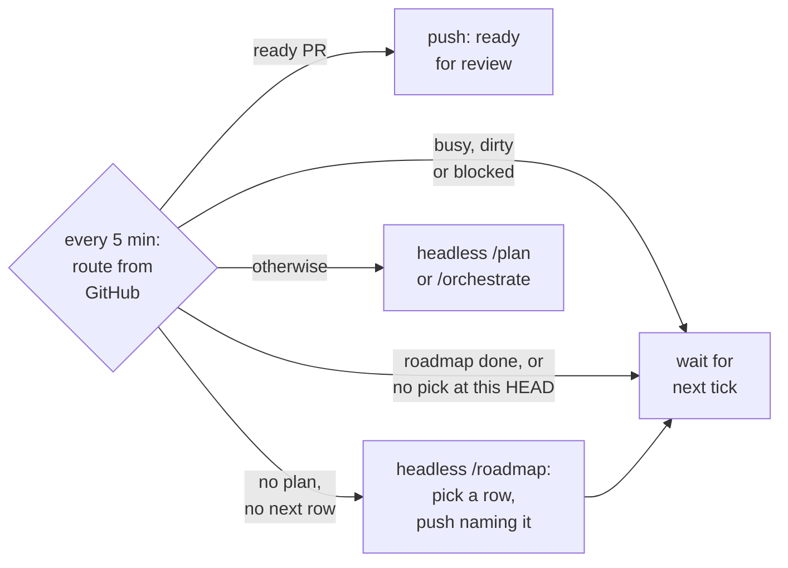
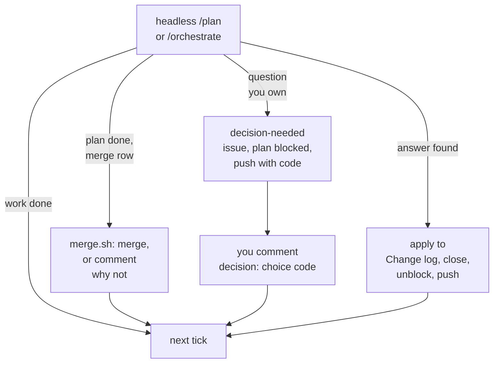

# Agent workflow

The same in every repo. Source: `itrumper/agents`, `workflow/`. Installed by
`<running copy>/workflow/adopt.sh <repo>`, which opens a PR off the default branch; merge it to opt in
(`--here` writes in place instead). `<running copy>` is the checkout of the source repo that the director's installed
`com.cure.director` plist names (`~/code/cure` by default), or your own clone of it on a Mac with no director. Updates come by themselves, and that is the preferred way: the director proposes
the same PR to each repo pinned to it once `workflow/` changes, between that repo's runs, one open PR at a time,
and you merge it. Run `adopt.sh <repo>` (or `--all`) by hand only for a repo no director runs. Updates are 3-way
merged, so a local edit survives, but a rule that differs per repo belongs in `CLAUDE.md`, not here.

## The chain

Goal → plan → milestone → work item (issue) → test → commit. Each link names its parent: a work-item
commit cites its issue, an issue its plan milestone or CR, a plan item its outcome.

## Roles

| Role | Runs as | Does | Never |
| -- | -- | -- | -- |
| You | the human | state the goal, answer the interview, approve the plan, demo each milestone, decide scope and invariant CRs, merge (unless the director may, below) |  |
| Planner | `/plan` in the main session | interview, write the plan, create issues, milestones, branch and draft PR | writes code |
| Orchestrator | `/orchestrate` in the main session | dispatch workers, verify, commit, triage CRs, have each milestone reviewed, keep plan status | writes feature code, merges other than through `director/merge.sh` |
| Worker | `worker` subagent | one issue: failing test, minimum code, gate green | commits, touches files outside its issue, changes scope |
| Reviewer | `code-reviewer` subagent, on another model than the workers | reviews one milestone's diff: numbered findings, each `blocking` or `backlog`, each with evidence (`file:line`, a failing test or a smaller sketch) | edits files |

## Artifacts (same paths everywhere)

| What | Where |
| -- | -- |
| Plan | `agent_docs/plans/<plan-issue>-<slug>.md`, from `agent_docs/plans/0000-template.md`. A plan that predates adoption keeps a date id, `YYYY-MM-DD-<slug>.md`, and has no plan issue |
| Roadmap | `agent_docs/roadmap.md`, seeded once: the repo's one living roadmap, its plans as rows (a goal bigger than one plan is a group of rows) plus the tables they share. Edited as plans land. A row gets the next letter when it becomes `next` and keeps it: A to Z, then AA, AB, ..., AZ, BA, ... (as spreadsheet columns); until then it goes by a short name. Letters are never reused or renumbered, so they follow execution order. The Plan column holds the plan issue `#<n>` once planned, or an existing issue; no issue is created for a row. Refer to a plan as `C (#<n>)` |
| Plan issue | GitHub issue, label `plan`. Its number is the plan id `<n>` |
| Work item | GitHub issue, label `work-item`, template `work-item.md`, GitHub milestone `P<n> M<k>: <title>` |
| Change request | GitHub issue, label `cr`, template `cr.md` |
| ADR | `agent_docs/adr/NNNN-slug.md`, from `0000-template.md` |
| Gate | `scripts/check.sh`: the full gate, run locally by the orchestrator before each push. `scripts/check.sh --fast`: only what the uncommitted change affects. Both repo-specific. CI workflows are off (`workflow_dispatch`) until you turn them on |
| Agent entry | `CLAUDE.md`: commands, invariants, core paths |

## Flow

1. `/plan <goal>`: the interview leads to an approved plan. It is committed on branch `plan/<n>-<slug>`,
   the issues and milestones are created, and a draft PR is opened.
2. `/orchestrate`: work items in waves (below), one commit per issue, the full gate and a push after each wave.
3. End of each milestone: acceptance tests green, then the `code-reviewer` reviews the milestone's diff. Blocking
   findings become CRs. A small backlog finding with a named fix (one or two files plus its test) becomes a work
   item in this milestone through round 3, first of all in files the milestone already changed; the milestone
   is ticked only after it lands. The rest become plain issues. Each round is posted on the PR as
   `Review M<k>: <b> blocking`.
   The reviewer reads `agent_docs/adr/` first; a finding inside a risk an ADR explicitly accepts is never blocking.
   After two rounds a blocking finding still open is a dispute, yours. Then you demo and say go.
4. End of plan: when every work item is done and the full `check.sh` is green on the pushed head, the orchestrator takes the PR out of
   draft and marks it ready for review. You review and merge it with a merge commit or a rebase. Never
   squash: that erases the issue-to-commit trail. Headless, when the base branch's roadmap (not the plan branch's)
   gives "Merge a plan PR that `director/merge.sh` accepts" to `director` in its Decision rights, the orchestrator
   merges instead, only through `director/merge.sh`.
   It merges with `--merge` only when the PR is open and ready, the local head is the pushed PR head, the base is an
   ancestor of it, the tree is clean, every milestone has a `Review M<k>: 0 blocking` comment, `check.sh` is green,
   the net diff touches no security trigger (dependency manifests, `*.env*`, `settings.json`, `*.plist`, paths under
   `auth/`, `crypto/`, `secret(s)/`, `migration(s)/`, `hook(s)/`, `.githooks/`, `.github/workflows/`, lock files, and
   the files that drive the gate: `CLAUDE.md`, `claude/CLAUDE.md`, `director/*.sh`, `skills/*/SKILL.md`, `claude/agents/*.md`, `scripts/check.sh`,
   `claude/*-hook.sh`; a path renamed away counts) and adds no skip marker outside `.md` files. Otherwise it comments the reason on the PR,
   which stays ready for you.

Resume at any time with `/orchestrate`. State lives in the plan file and the issues, not in a session.

## Speed

- **Parallel plans first.** Independent plans run at the same time, each in its own session, clone or
  Mac, with nothing to merge inside a plan. The planner says which plans are independent.
- **Fast gate per item, full gate per wave.** Workers and the orchestrator's per-item check run
  `check.sh --fast`. The orchestrator runs the full `check.sh` after each wave, before pushing.
- **Waves.** A wave is the items of a milestone not yet `done` whose `After` items are all `done`. By default a wave
  runs one item at a time in the main tree. Items run in parallel, each in an isolated worktree, only
  when `CLAUDE.md` says `Parallel waves: max <N>` (N ≤ 3) and the items' files and tests are pairwise
  disjoint. Turn it on only where builds are cheap: every worktree builds cold, parallel builds share
  the CPU, and a clash appears only after integration.

## Headless runs (director)

Optional. The director runs `/plan` and `/orchestrate` with no one watching, and asks you only what the
roadmap's Decision rights give you (ADR-0003 in `itrumper/agents`). Each run's prompt is
`/<skill> headless (running copy: <path>)`, and the skill calls `director/` scripts from that `<path>`.

- **Turn it on**: add `Director: on <LocalHostName>` to `CLAUDE.md`, naming one Mac
  (`scutil --get LocalHostName`). Every 5 minutes that Mac's director looks at GitHub and starts at most
  one run per repo: `/plan` for a draft plan or a `next` roadmap row, `/orchestrate` for an approved plan. It
  skips a repo while a plan is blocked on you, while a `claude` session is in the tree, or while the tree
  has uncommitted changes. With no open plan it routes from the default branch (a tree left on a merged plan
  branch switches back first).
- **Between plans**: no open plan and no `next` row runs `/roadmap headless`, which picks the next row itself
  and commits the roadmap; a low push names the pick with its Change log line, and the next tick plans it. A
  run that picks nothing is not repeated at the same HEAD (one low push): edit or push the roadmap to wake it.
  Roadmap `Status: done` makes no run: it logs `idle: roadmap done` and pushes once (low); set `Status: active` or run `/roadmap` to wake it.
- **Background runs**: each run goes in the background, so one tick serves every repo. A repo whose run is
  still going logs `skipped: running`. At most `DIRECTOR_MAX_RUNS` (default 2) run at once per Mac, set with
  `export DIRECTOR_MAX_RUNS=<n>` in `~/.config/agent-env.sh` (without `export` it is ignored); the rest log
  `skipped: max runs` and wait for a slot. While the director's own checkout waits to fast-forward to an update, no
  new run starts: those repos log `skipped: updating director` until the runs still going finish. A background run that exits 0 and commits starts the next tick at once; a failed
  or no-op run waits the 5 minutes. To tick now by hand: `launchctl kickstart gui/$(id -u)/com.cure.director`.
- **Pushes** (Pushover). Normal: a decision is needed (with its code), an escalation was closed without an
  answer and reopened, a plan PR is ready for review. Low: an answer was applied, a run failed, a plan issue
  has no open PR (stale), the tree was busy or dirty for 2 hours, `gh` failed, a workflow update failed
  (`~/Library/Caches/agent-director/<repo>.adopt.out` says why).
- **Escalations**: a question you own becomes a `decision-needed` issue with Context, Options and its
  Decision rights row. Options is a table `| Choice (type this) | Option | Trade-off |`, one row per option;
  Choice is one lowercase word, the recommended row first with `(recommended)` after its word, e.g.
  `` `drop` (recommended) ``. The plan issue gets `blocked` and a "waiting on #<e>" comment. Before a
  plan is approved, `/plan` publishes a draft plan issue (body starts `Status: draft`) to hang it on.
  Between plans (a row drop is yours) the escalation has no plan issue: `/roadmap` writes `Waiting on: #<e>`
  in `roadmap.md`, the director skips the repo until #<e> has an answer, and the run that applies it clears
  the line.
- **Answer** with a comment `decision: <choice> <code>`, `<choice>` a word from the Choice column, e.g.
  `decision: drop <code>`. The prefix matches in any case; the code is case-sensitive and must be the last word. It comes
  only in the push, and no file keeps it (an agent could read it); lost it? Pushover's message history.
  A `decision:` comment without the right code gets one "Not applied" reply. The next run applies the answer
  (quoted in the plan's Change log), closes the issue, and unblocks the plan.
- **Never close an escalation to drop it**: a close without an answer reopens it. Answer a duplicate or moot
  one with its code instead, e.g. `decision: duplicate of #5 <code>`.
- **Merge**: a finished plan merges headless only through `director/merge.sh` and only with the merge row
  (Flow step 4). A refusal (`security trigger: <paths>`, `skipped test: <file>`, or another reason) is a PR
  comment and the "ready for review" push; the PR is yours. Interactive `/orchestrate` never merges.
- **Discuss first**: open `claude` in your own clone, not the director's tree (a session there makes the
  director skip the repo). Talk it through, then post the `decision:` comment.

## Plans

- One plan = one branch = one PR. Aim for at most 4 milestones and 15 work items (a recommendation, not a
  cap). Bigger usually means sequential plans,
  ordered in a roadmap. A plan on the roadmap names its row in its header; the planner scopes only the next row.
- Milestones are vertical slices: each can be demoed end to end. Nothing horizontal ("the storage layer") ships alone.
- M1 is the walking skeleton: the thinnest end-to-end slice, in production code, gate green. An ADR the plan
  rests on whose premise the code has not tested yet stays `proposed`, and M1 exercises it once. The M1 demo
  gives each such ADR a verdict. Go: the ADR is accepted, its Decision rewritten to what was built and a
  Verdict section saying what the skeleton measured and changed. No-go: a CR revises the plan. A spike
  answers a question without production code; a skeleton answers it with the code the plan keeps.
- Every outcome has an acceptance test. Every work item serves an outcome. Cut items land in Non-goals, not in the void.
- Before scoping, the planner checks open issues, plans in progress and rejected CRs. Each related issue is
  absorbed (the plan delivers it), superseded (the plan makes it moot) or left open, and the user confirms
  which. Absorbed and superseded issues close with the plan's PR, under Closing issues.
- Core changes listed in the approved plan are approved with it. After approval, scope changes only
  through a CR you accept, and each is recorded in the plan's Change log.

## Work items

- One or two source files plus their tests, one behaviour, one stop condition. Bigger means split.
- Each item's Approach cell in the plan's table says why this shape, in the template's form:
  `<shape> because <reason>; considered <alternative>`, or `forced (<what forces it>)`.
- Spike: timeboxed, answers a question, output is an issue comment or an ADR, no production code. The only TDD exemption.

## TDD

1. Write the failing test first and run it. Its failure goes into the issue comment.
2. Write the minimum code that passes.
3. Run `scripts/check.sh --fast`. Green or not done. The full gate runs at the end of the wave.

- Acceptance tests: the first item of each milestone writes them skipped, citing the issue
  (`#[ignore = "#14"]`, `it.skip`). The last item unskips them. A milestone with a skipped acceptance test is not done.
- Enforced by `scripts/check-tests-touched.sh` (pre-commit hook). Source
  paths are in `scripts/workflow.env`. Never `--no-verify`.

### Oracles

An oracle is where a test's expected values come from. It must not be the code under test.

- Every new test file has a comment line `oracle: <kind> <source>`, e.g. `# oracle: paper Smith 2019, eq. 4`.
  Kinds: `spec`, `paper`, `url`, `fixture` (recorded, with its source), `closed-form`, `property`,
  `metamorphic`, `reference` (another implementation), `measurement`, `user`.
- Agents propose oracles. You approve the acceptance tests' oracles in one batch, in the Oracle column of the
  plan's or roadmap's Outcomes table. An approved oracle changes only by your decision, through a CR.
- No known answer? Test what must hold instead:
  - property: an invariant over many inputs (round-trips, bounds, conservation, idempotence).
  - metamorphic: how the output must change when the input changes (scale in, scale out; permute, same sum).
  - reference: compare against an independent implementation (a library, a slow brute force).

## Writing for review

PR bodies, issues and review, demo or deferral comments. The reader should find the point in one screen.

- **TL;DR first**: anything longer than a few paragraphs opens with a one-line status, verdict or ask.
  Escalations meet this through their title (the question) and Options (recommended first).
- **Tables** for comparisons and options, not prose.
- **Mermaid** blocks for flows and state, not ASCII art.
- **Images** get a caption naming what to look for. In a private repo, commit the image and link it as
  `https://github.com/<owner>/<repo>/blob/<sha>/<path>?raw=true` (a `raw.githubusercontent.com` link breaks).
- **Logs folded**: a one-line result, then the output inside `
`.
- **PR order**: the draft line, Summary, Review guide, Outcomes, Milestones, then the `Closes` lines last
  (`.github/pull_request_template.md`).

## Docs

Each fact has one owner. Write it there and link to it elsewhere.

| Reader or fact | Owner |
| -- | -- |
| Agents | `agent_docs/` (plans, roadmap, this file) and `CLAUDE.md` |
| Developers | `dev_docs/`, the developer site |
| Users | `docs/` where the repo has one. A repo whose only user is its developer has none |
| A decision | an ADR in `agent_docs/adr/` |
| A script's details | its header |
| `README.md` | the front door: one paragraph, a quickstart and links |

- **Site build**: a repo with `zensical.toml` builds its site with `zensical build --strict` from one
  guarded line in the full `scripts/check.sh` (`[ ! -f zensical.toml ] || uvx zensical@<version> build --strict`),
  never under `--fast`. A repo without `zensical.toml` skips it. Adoption seeds that line only in a new
  `check.sh`; a repo with its own adds it to the full branch.
- **Site root**: `dev_docs/` (`docs_dir`). Each ADR is a symlink under `dev_docs/adr/` to its file in
  `agent_docs/adr/`, with a nav line under the `Decisions` section of `zensical.toml`. Links inside an ADR
  resolve from `dev_docs/adr/`.
- **Admonitions** (`!!! note`) are allowed: the format hook keeps them.

## Closing issues

An agent closes an issue only in one of these cases, with a comment giving the evidence. Everything else stays open.

- **Completed** by a merged PR, through its `Closes #<n>` line (or an escalation, once its answer is applied).
- **Wrong**: shown wrong, e.g. a reproduction that fails, with its output.
- **Impossible**: shown impossible, with the reason.
- **Fixed elsewhere** by another closed issue or merged PR, linked. A split or a migrated issue cites the issues that now carry its scope.
- **Moot**: a merged feature removed or changed the behaviour, so the issue can no longer happen. Link the PR and name the code that no longer does it.

Agents never apply `wontfix`: only the user does, and closes that issue at the same time. Deferring is always allowed; a deferral reason names a condition it waits for, or "outranked by <row or issue>".

## Commits

- One commit per work item. Subject: `M<k> #<issue>: <what changed>`. Body: the why, one line per
  choice, as `<choice> because <reason>; considered <alternative>`, or
  `forced (<what forces it>)`, so a reviewer can attack the reason.
  Plan and status commits: `Plan #<n>: <what>`. Other commits need no issue. Never start a subject with
  `#`: git strips it as a comment.
- In `agent_docs/`, a bare `#<n>` is this repo's issue (the format hook links it here). Write another
  repo's issue as `owner/repo#<n>` or its URL, which stay text.
- Write review and critic finding numbers without `#` (`finding 9`): a bare `#<n>` is an issue.
- Only the orchestrator commits. Push after each wave, once the full gate is green.
- Issues close when the PR merges, and only through the PR body: GitHub links and closes issues listed
  there (`Closes #<n>`), not ones named in commit messages. The PR body has one `Closes #<n>` line for
  the plan issue, every work item, and every absorbed or superseded issue. The orchestrator keeps that list current. A
  committed item is labelled `done`; it stays open until the merge.

## Core, CRs, ADRs

- Core = the paths under "Core" in `CLAUDE.md`, plus `CLAUDE.md`, `agent_docs/adr/`, and the scope of an approved plan.
- A core change the plan did not list needs a CR issue. A worker that needs one stops and returns a CR
  draft. Never implement it in the item that found the need. A core path listed in an issue's Files is
  allowed: the approved plan or an accepted CR put it there.
- A CR parks its item, not the plan. The orchestrator discards the item's partial changes, labels it
  `blocked`, and carries on with other ready items. The accepted core change becomes a work item that
  the parked item runs `After`. CRs that need you are asked together at the end of the wave.
- Who decides: the orchestrator decides CRs that keep every invariant. You decide CRs that change an
  invariant, an ADR, or plan scope. A decision is a comment, a label (`cr:accepted` or `cr:rejected`)
  and a reason. An accepted CR becomes work items in the current milestone. Rejected CRs stay, so the
  question is not asked twice.
- ADR: for a decision that constrains future work and had a real alternative. Written `proposed`; accepted
  when the plan is approved, or at the M1 verdict if the skeleton tests it. Once accepted it is
  never edited. Supersede it with a new ADR.

## Done

- Work item: its test was red, then green. `check.sh --fast` is green. Only its files changed. Committed, labelled `done`, the red and green output on the issue, and listed in the PR body.
- Wave: its items committed, full `check.sh` green, pushed.
- Milestone: all its items `done`, acceptance tests unskipped and green, full `check.sh` green on the pushed head (run by the orchestrator), `Review M<k>: 0 blocking` on the PR, demoed.
- Plan: every milestone done, full `check.sh` green on the pushed head, docs updated where behaviour changed, `CLAUDE.md` commands re-verified
  and logged in the plan's Change log, Status: done, `Closes #<n>` in the PR body for the plan issue and every work item, PR ready (or merged by `director/merge.sh`).

## Anti-patterns that fail review

- "While I was here" changes. A `TODO` without an issue. Commented-out code.
- A test that asserts on a fixture made in the same item without a recorded source.
- An oracle that is the code under test: expected values pasted from its own output.
- Counts or measurements in `CLAUDE.md`. They rot.
- Parallel workers in one working tree.
